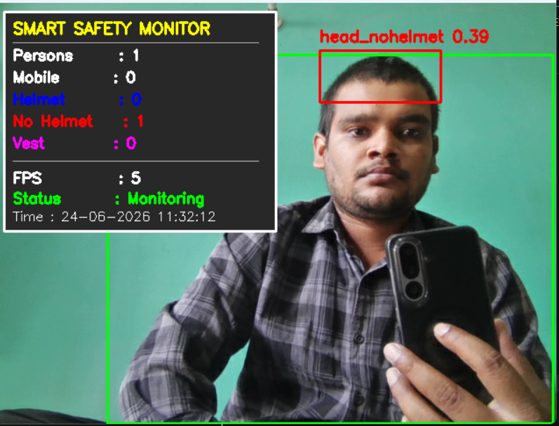
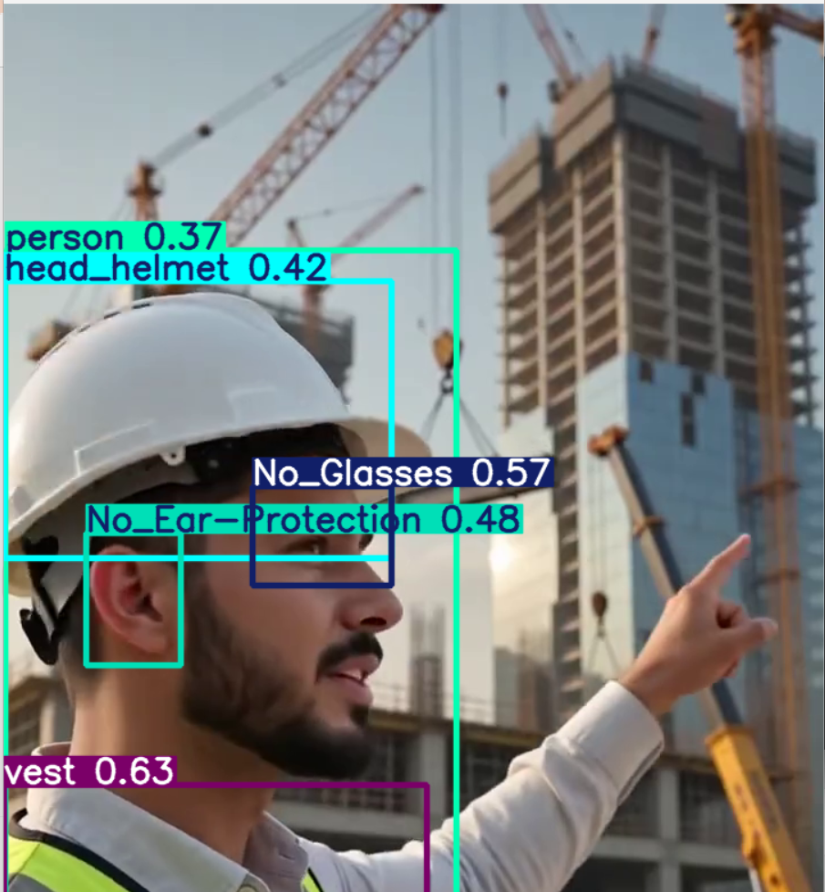
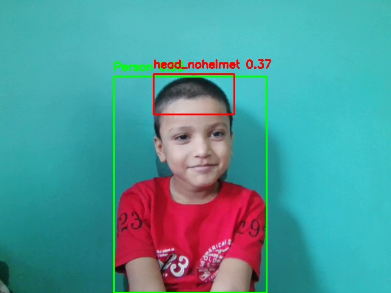
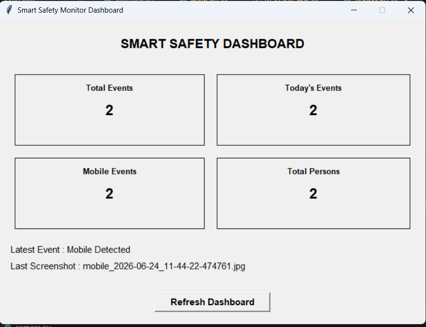

# 🛡️ Smart Safety Monitor

> **An AI-Powered Workplace Safety Monitoring System using Python, OpenCV, YOLOv8 and Tkinter Dashboard**

Smart Safety Monitor is a modular Computer Vision application designed to improve workplace safety through real-time AI-powered surveillance.

The system continuously monitors live camera feeds and detects workplace safety violations using multiple YOLOv8 models.

It supports:

- 👤 Person Detection
- 📱 Mobile Phone Detection
- 🪖 Helmet Detection
- 🚫 No Helmet Detection
- 🦺 Safety Vest Detection
- 🔫 Weapon Detection

Whenever a violation occurs, the application automatically:

- 📸 Captures screenshots
- 📝 Logs events into CSV
- 📊 Updates Dashboard Analytics
- ⚡ Prevents duplicate alerts
- 📈 Displays live monitoring statistics

The project follows a modular software architecture, making it easy to extend with additional AI models such as Fire Detection, Intrusion Detection, PPE Compliance, and RTSP Camera Monitoring.

---

# ✨ Features

## 🎯 AI Detection

- Real-Time Person Detection
- Mobile Phone Detection
- Helmet Detection
- No Helmet Detection
- Safety Vest Detection
- Weapon Detection
- Triple YOLOv8 Model Architecture

---

## 📊 Live Monitoring

- Live Webcam Monitoring
- Professional Status Panel
- Live Person Counter
- Live Mobile Counter
- Live Helmet Counter
- Live No Helmet Counter
- Live Safety Vest Counter
- Live Weapon Counter
- Live FPS Counter
- Live Date & Time

---

## 🚨 Violation Management

- Mobile Violation Detection
- No Helmet Violation Detection
- Weapon Violation Detection
- Frame-Based Event Confirmation
- Duplicate Event Prevention
- Modular Violation Manager

---

## 📸 Evidence Collection

- Automatic Screenshot Capture
- Timestamped Image Saving
- Organized Screenshot Folder
- Event-wise Screenshot Naming

---

## 📝 Event Logging

- CSV Event Logging
- Event Timestamp
- Person Count
- Mobile Count
- Helmet Count
- No Helmet Count
- Vest Count
- Weapon Count
- Screenshot Name

---

## 📊 Dashboard

- Tkinter Dashboard
- Live Statistics
- Latest Event Viewer
- Latest Screenshot Viewer
- Dashboard Auto Refresh
- Event Analytics
- CSV-based Monitoring

---

## 🏗️ Software Architecture

- Modular Python Project
- Object-Oriented Design
- Multiple AI Model Support
- Event Manager
- Violation Manager
- Screenshot Manager
- Logger Module
- Reusable Drawing Module
- Clean Code Structure

---

# 📂 Project Structure

```text
Smart_Safety_Monitor/

│
├── dashboard/
│   ├── __init__.py
│   ├── analytics.py
│   └── dashboard.py
│
├── docs/
│   └── images/
│
├── logs/
│
├── models/
│   ├── coco/
│   ├── ppe/
│   └── weapon/
│
├── output/
├── screenshots/
├── videos/
│
├── utils/
│   ├── camera.py
│   ├── constants.py
│   ├── date_time.py
│   ├── detector.py
│   ├── drawing.py
│   ├── event_manager.py
│   ├── fps.py
│   ├── logger.py
│   ├── mobile_detector.py
│   ├── ppe_detector.py
│   ├── screenshot.py
│   ├── violation_manager.py
│   └── weapon_detector.py
│
├── main.py
├── test_ppe_model.py
├── test_ppe_video.py
├── test_weapon_model.py
├── requirements.txt
├── README.md
└── .gitignore
```

---

# 🛠️ Tech Stack

## Programming Language

- Python 3.10

## Computer Vision

- OpenCV

## Deep Learning

- YOLOv8 (Ultralytics)

## Framework

- PyTorch

## Dashboard

- Tkinter

## Data Processing

- Pandas
- NumPy

## Visualization

- OpenCV Drawing API

## Logging

- CSV

## Version Control

- Git
- GitHub

---

# 🚀 Installation

## 1️⃣ Clone the Repository

```bash
git clone https://github.com/vikas-tikapur/Smart_Safety_Monitor.git

cd Smart_Safety_Monitor
```

---

## 2️⃣ Create a Virtual Environment

```bash
py -3.10 -m venv venv
```

---

## 3️⃣ Activate the Virtual Environment

### Windows PowerShell

```powershell
.\venv\Scripts\Activate.ps1
```

### Windows Command Prompt

```cmd
venv\Scripts\activate
```

---

## 4️⃣ Install Required Packages

```bash
pip install -r requirements.txt
```

---

# ▶️ Running the Application

## Start Smart Safety Monitor

```bash
python main.py
```

---

## Open Dashboard

```bash
python -m dashboard.dashboard
```

---

## Test PPE Model

```bash
python test_ppe_model.py
```

---

## Test PPE Video

```bash
python test_ppe_video.py
```

---

## Test Weapon Detection Model

```bash
python test_weapon_model.py
```

---

# 🤖 AI Models

The project uses multiple YOLOv8 models for different detection tasks.

| Model | Purpose | Status |
|--------|---------|:------:|
| YOLOv8 COCO | Person Detection | ✅ |
| YOLOv8 COCO | Mobile Phone Detection | ✅ |
| PPE YOLOv8 | Helmet Detection | ✅ |
| PPE YOLOv8 | No Helmet Detection | ✅ |
| PPE YOLOv8 | Safety Vest Detection | ✅ |
| Weapon YOLOv8 | Weapon Detection | ✅ |

---

# 🧠 Detection Pipeline

```text
Live Camera
      │
      ▼
 Frame Capture
      │
      ▼
──────────────────────────────────
YOLOv8 COCO Detector
──────────────────────────────────
      │
      ├── Person Detection
      └── Mobile Detection
      │
      ▼
──────────────────────────────────
PPE YOLOv8 Detector
──────────────────────────────────
      │
      ├── Helmet
      ├── No Helmet
      └── Safety Vest
      │
      ▼
──────────────────────────────────
Weapon YOLOv8 Detector
──────────────────────────────────
      │
      └── Weapon Detection
      │
      ▼
Violation Manager
      │
      ▼
Event Manager
      │
      ├── Screenshot Manager
      ├── CSV Logger
      └── Dashboard
```

---

# 📈 Current Progress

| Module | Status |
|------------------------------|:------:|
| Project Architecture | ✅ |
| Modular Design | ✅ |
| Camera Module | ✅ |
| YOLOv8 COCO Detection | ✅ |
| Person Detection | ✅ |
| Mobile Detection | ✅ |
| PPE Detection | ✅ |
| Helmet Detection | ✅ |
| No Helmet Detection | ✅ |
| Safety Vest Detection | ✅ |
| Weapon Detection | ✅ |
| Drawing Module | ✅ |
| Screenshot Manager | ✅ |
| CSV Event Logging | ✅ |
| Event Manager | ✅ |
| Violation Manager | ✅ |
| Dashboard | ✅ |
| Dashboard Analytics | ✅ |
| Live Counters | ✅ |
| Auto Refresh | ✅ |
| Documentation | ✅ |

---

# 📊 Project Completion

| Component | Progress |
|-----------|:--------:|
| Core Architecture | 100% |
| AI Detection | 100% |
| Dashboard | 100% |
| Event Management | 100% |
| Violation Management | 100% |
| Documentation | 100% |
| Code Cleanup | 100% |

# 🎯 Overall Completion

# **≈ 98%**

The remaining work consists of optional enterprise-level features such as:

- RTSP Camera Support
- Email Alerts
- Audio Alarm
- Multi-Camera Monitoring
- AI Reports

These features are planned for future releases and are **not required for Version 1.0**.

---

# 📦 Current Release

## **Version 1.0.0 Release Candidate (RC)**

### ✔ Completed

- Triple YOLOv8 Model Architecture
- Person Detection
- Mobile Detection
- PPE Detection
- Weapon Detection
- Live Monitoring Dashboard
- Screenshot Capture
- CSV Logging
- Event Manager
- Violation Manager
- Professional Monitoring Panel
- Live Statistics
- Code Cleanup
- Documentation

---

# 🏗️ System Architecture

```text
                           Live Camera
                                │
                                ▼
                        Video Frame Capture
                                │
        ┌───────────────────────┼────────────────────────┐
        ▼                       ▼                        ▼
 ┌────────────────┐     ┌────────────────┐      ┌────────────────┐
 │ YOLOv8 COCO    │     │ PPE YOLOv8     │      │ Weapon YOLOv8  │
 │                │     │                │      │                │
 │ • Person       │     │ • Helmet       │      │ • Weapon       │
 │ • Mobile       │     │ • No Helmet    │      │                │
 │                │     │ • Safety Vest  │      │                │
 └────────────────┘     └────────────────┘      └────────────────┘
        │                       │                        │
        └───────────────┬───────┴───────────────┬────────┘
                        ▼
              Detection Aggregation
                        │
                        ▼
               Violation Manager
                        │
                        ▼
                 Event Manager
                        │
        ┌───────────────┼────────────────┐
        ▼               ▼                ▼
 Screenshot      CSV Event Logger   Live Dashboard
   Manager                               │
                                         ▼
                              Dashboard Analytics
```

---

# 📸 Project Preview

## 🖥️ Live Monitoring



---

## 👷 Helmet Detection



---

## 🚫 No Helmet Detection



---

## 🔫 Weapon Detection


---

## 📊 Dashboard



---

# 🎯 Project Goals

The primary objective of this project is to build a modular AI-powered workplace safety monitoring system capable of detecting safety violations in real time.

Current goals achieved:

- ✅ Real-time workplace monitoring
- ✅ Multi-model AI detection
- ✅ Modular architecture
- ✅ Event-based violation management
- ✅ Automated screenshot capture
- ✅ CSV event logging
- ✅ Live monitoring dashboard
- ✅ Professional code structure
- ✅ Extensible architecture

---

# 🚀 Future Roadmap

## Version 1.1

- RTSP/IP Camera Support
- Video File Processing
- Email Alerts
- Audio Alarm
- Dashboard Charts
- Daily Reports
- Better Dashboard UI

---

## Version 1.2

- Multi-Camera Monitoring
- Face Recognition
- Attendance System Integration
- Fire Detection
- Smoke Detection
- Restricted Area Detection

---

## Version 2.0

- Cloud Dashboard
- Web Application
- User Authentication
- AI Safety Reports
- Database Integration
- REST API
- Docker Deployment
- Edge AI Deployment

---

# 💼 Resume Highlights

This project demonstrates practical experience in:

- Python Development
- Computer Vision
- Deep Learning
- YOLOv8
- OpenCV
- Object-Oriented Programming
- Modular Software Architecture
- Event-Driven Programming
- Dashboard Development
- Real-Time Video Processing
- AI-Based Workplace Safety Monitoring

---

# ⭐ Why This Project?

This project is designed to simulate a real-world industrial safety monitoring solution.

It combines multiple AI models into a single modular application capable of monitoring workplace safety in real time while generating evidence, logs, and analytics.

The architecture is scalable and can easily be extended with additional AI models, making it suitable for future enterprise-level surveillance applications.

---

# 👨‍💻 Author

## Vikas Mishra

**AI / ML Developer | Python Developer | Computer Vision Enthusiast**

### Connect with Me

- GitHub: https://github.com/vikas-tikapur

---

# 📄 License

This project is intended for educational purposes and portfolio demonstration.

You are free to fork, learn from, and improve this project while giving appropriate credit.

---

# 🤝 Contributing

Contributions are always welcome!

If you have ideas for improving this project:

1. Fork the repository
2. Create a new feature branch

```bash
git checkout -b feature-name
```

3. Commit your changes

```bash
git commit -m "Add new feature"
```

4. Push to your branch

```bash
git push origin feature-name
```

5. Open a Pull Request

---

# 🧪 Tested On

- Windows 11
- Python 3.10
- OpenCV
- Ultralytics YOLOv8
- PyTorch
- Tkinter

---

# 📌 Project Statistics

### Programming Language

- Python

### AI Models

- YOLOv8 COCO
- YOLOv8 PPE
- YOLOv8 Weapon

### Detection Modules

- Person Detection
- Mobile Detection
- Helmet Detection
- No Helmet Detection
- Safety Vest Detection
- Weapon Detection

### Event System

- Screenshot Manager
- CSV Logger
- Event Manager
- Violation Manager

### Dashboard

- Live Monitoring
- Analytics
- Latest Events
- Latest Screenshot
- Auto Refresh

---

# 🎓 Learning Outcomes

This project helped in learning:

- Object-Oriented Programming
- Modular Software Development
- OpenCV
- YOLOv8 Integration
- Multiple AI Model Integration
- Event-Driven Programming
- CSV Logging
- Dashboard Development
- Real-Time Computer Vision
- Software Architecture Design
- Git & GitHub Workflow
- Debugging and Testing

---

# 🔮 Future Enhancements

- RTSP Camera Support
- Multi-Camera Monitoring
- Email Notifications
- Telegram Alerts
- Audio Alarm
- Fire Detection
- Smoke Detection
- PPE Compliance Reports
- Cloud Dashboard
- REST API
- Docker Deployment
- Database Integration
- User Authentication

---

# 🏆 Project Highlights

✔ Triple YOLOv8 Model Architecture

✔ Real-Time Workplace Monitoring

✔ AI-Based Safety Violation Detection

✔ Modular Python Architecture

✔ Automated Screenshot Capture

✔ Event Logging

✔ Dashboard Analytics

✔ Professional Monitoring Panel

✔ Live Statistics

✔ Production-Ready Project Structure

---

# 🙏 Acknowledgements

Special thanks to the open-source community and the developers behind:

- Ultralytics YOLOv8
- OpenCV
- PyTorch
- Pandas
- NumPy

These libraries made it possible to build a real-time AI-powered workplace safety monitoring application.

---

# ⭐ Support

If you found this project useful:

⭐ Star this repository

🍴 Fork this repository

💡 Share your suggestions

🤝 Contribute to future improvements

---

# 🚀 Version

## **Smart Safety Monitor v1.0.0**

### Release Status

**Release Candidate (RC)**

Current Features:

- ✅ Person Detection
- ✅ Mobile Detection
- ✅ Helmet Detection
- ✅ No Helmet Detection
- ✅ Safety Vest Detection
- ✅ Weapon Detection
- ✅ Screenshot Capture
- ✅ CSV Logging
- ✅ Dashboard Analytics
- ✅ Event Manager
- ✅ Violation Manager
- ✅ Live Monitoring UI

---

## 📢 Final Note

Smart Safety Monitor is a modular AI-powered workplace surveillance system developed to demonstrate real-world applications of Computer Vision, Deep Learning, and Software Engineering.

The project focuses on building a scalable, maintainable, and production-oriented architecture that can be extended with future AI modules and enterprise-grade monitoring capabilities.

---

<div align="center">

# ⭐ Thanks for Visiting ⭐

### If you like this project, don't forget to ⭐ Star the repository!

**Made with ❤️ by Vikas Mishra**

</div>